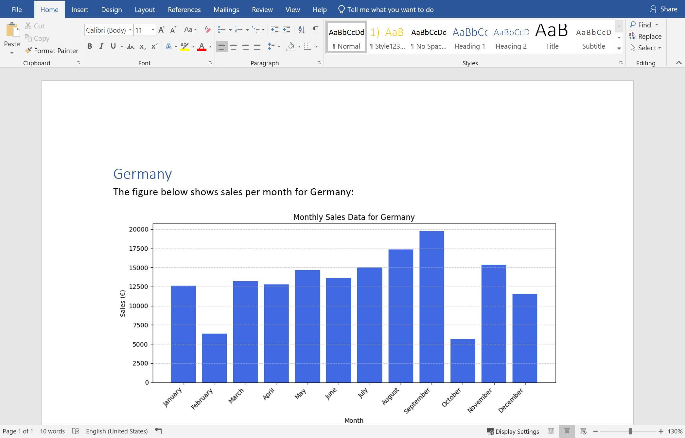
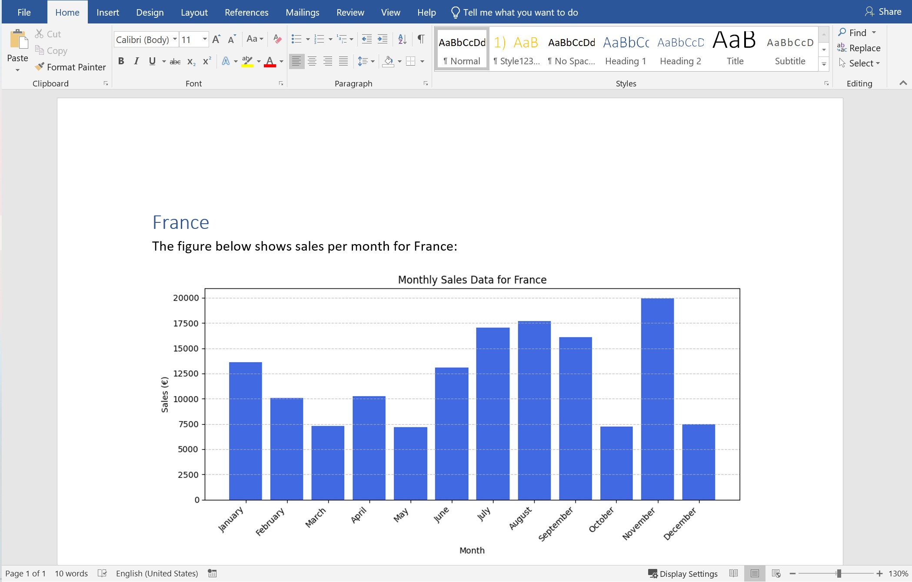

# OpenReport

## Overview
OpenReport is a powerful YAML-based tool for creating fully automated and parameterized documents. 
OpenReport streamlines the integration of user's own analysis and custom formatting into structured reports.

For more information please visit: 
https://apt-software.com 

For full documentation please visit: 
https://openreport.netlify.app/

## Features
- Parses a YAML specification file, which can be intuitively created using autocomplete.
- Supports essential document components including texts, headings, tables and figures:
  - components can be generated dynamically based on the user's own analysis.
  - components can be parameterized specifying text and heading styling, table formatting, and figure embedding.
- Supports user-defined parameters for enhanced flexibility.
- Supports loop for adding repetitively (a set of) similar components.
- Supports loop for document batch creation.
- Generates fully formatted Word or PDF documents from a YAML specification file.

The YAML file defines a structured sequence of actions, including generation and formatting rules, which OpenReport 
converts into ready-to-use document.

## Functionality
OpenReport offers a structured and reusable approach to document creation. Using an intuitive YAML-based framework, 
it allows users to define the structure, formatting, and content of automated reports. 
From a YAML specification file, OpenReport generates a Word (.docx) or PDF document containing a well-organized set of parameterized elements, including:

- Text
- Headings
- Tables (with captions)
- Figures (with captions)
- Mathematical expressions
- Bullet lists
- External Word files
- Automatically generated:
  - Table of contents
  - List of figures 
  - List of tables

A valid YAML file must contain 'document', 'name', and 'structure' keys. For example:
```yaml
document:
  name: document.docx
  structure:
    - heading: 
        # heading attributes
    - text:
        # text attributes
    - table:
        # table attributes
    - figure:
        # figure attributes
```
This specification initiates a document with attributes 'name' (document.docx) and 'structure' which lists all the document
components. The order components appear under 'structure' reflects the order in the document. Component attributes specify the 
formatting and generation rules. 

### Component formatting
Each component supports custom formatting. For example:
```yaml
- text:
    body: Hello World!
    font: Calibri
    size: 9
```
This specification adds text "Hello World!" to the document with fixed attributes 'size' (9) and 'font' (Calibri). 

The full formatting functionality is available at:

### Component generation
Components can be dynamically generated using the 'source' key. For example:
```yaml
- figure:
    source:
      output: figure
      source_type: local
      location: 'inputs/figure.jpg'
```
This specification adds figure that is stored locally at 'inputs/figure.jpg' to the document.

The generation mode can be 'local' (for locally stored files) or 'python' (for output generated by python code).
With python mode any kind of user's own analysis can be incorporated directly in the desired place of the document. 
For example: 
```yaml
- table:
    source:
      output: table
      source_type: python
      python_executable: generate_table.py
    table_font: Times New Roman
    table_font_size: 9
    caption:
      body: This is a table caption
```
This specification adds table to the document. The table is an output of user-defined function 'generate_table.py'. The 
table's text is fixed with attributes 'table_font_size' (9) and 'table_font' (Times New Roman). The table's caption is "This is a table caption". 

The inputs for user-defined function can be specified directly under 'source'. For example:
```yaml
- figure:
    source:
      output: figure
      source_type: python
      python_executable: plot_sales_per_year.py
      country_name: France
```
This specification adds figure to the document. The figure is an output of user-defined function 'plot_sales_per_year.py' 
with input parameter 'country_name' (France). This is equivalent to:
```python
fig = plot_sales_per_year(country_name="France")
```
The full generation mode functionality is available at:
  

### Parameters
OpenReport allows to declare a parameter and assign it a value. For example:
```yaml
- parameter: 
    parameter_name: year
    parameter_type: manual
    parameter_value: 2025
```
This specification declares parameter (year). User manually assigns it a value (2025). 
The declared parameter can be referenced throughout the document using the @parameter{parameter_name} format:
```yaml
- text:
    body: Happy New @parameter{year} Year!
    colour: #ffffff
```
This specification adds text "Happy New 2025 Year!" to the document with attribute 'colour' in HEX format (#ffffff).

Parameters can be defined using 'source' key. For example:
```yaml
- parameter:
    parameter_name: total_sales
    parameter_type: source
    source:
      output: text
      source_type: python
      python_executable: calculate_total_sales.py
```
This specification declares parameter (total_sales). The value of parameter is an output of user-defined function 
'calculate_total_sales.py'. The parameter value can be addressed within the rest of the document:
```yaml
- text:
    body: Total sales for year @parameter{year} is @parameter{total_sales}.
```
If 'calculate_total_sales.py' outputs 250,000, the document will contain:
```
Total sales for year 2025 is 250,000.
```

The full parameter functionality is available at:

### Iterations 
OpenReport allows to declare a loop and add repetitively (a set of) similar objects. For example:
```yaml
- loop:
    iterator_name: year
    iterator_type: manual
    iterator_values: [2025, 2026]
    iterator_applicable:
      - text:
          body: Total sales for year @iterator{year} have increased.
```
This specification declares iterator (year). User manually specifies iterator values (2025, 2026). 
The document will contain:
```
Total sales for year 2025 has increased.
Total sales for year 2026 has increased.
```

Loops can be defined using 'source' key. For example:
```yaml
- text:
    body: "The sales per month are:"
- loop:
    iterator_name: sales_month_i
    iterator_type: source
    source:
      output: array
      source_type: python
      python_executable: calculate_sales_per_month.py 
    iterator_applicable:
      - text: 
          body: " - @iterator{sale_month_i} EUR" 
```
This specification declares iterator (sales_month_i). The values of the iterator are an output of user-defined function 
'calculate_sales_per_month.py'. If the script outputs [10, 20, 30], the document will contain:
```
The sales per month are:
 - 10 EUR
 - 20 EUR
 - 30 EUR
```
Nested loops are also supported. 
The full loop functionality is available at:

### Document Iterations
OpenReport enables batch document creation: For example:
```yaml
document_loop:
  iterator_name: country
  iterator_type: manual
  iterator_values: [Germany, France]
  iterator_applicable: 
    - document:
        name: @iterator{country}_sales_report.docx
        structure:
          - heading: 
              body: @iterator{country}
          - text: 
              body: "The figure below shows sales per month for @iterator{country}:"
          - figure:
              source:
                output: figure
                source_type: python
                python_executable: plot_sales_per_year.py
                country_name: @iterator{country}
```
This specification creates two documents (Germany_sales_report.docx and France_sales_report.docx). Each document has
a heading specifying the country name, a text and a figure generated by user-defined function 'plot_sales_per_year.py'
with input parameter 'country_name'. The example of output for Germany is:


The example of output for France is:


The full document loop functionality is available at:

## License
This project is licensed under the End-User License Agreement (EULA) - see 
the [LICENSE](https://github.com/APT47/OpenReport/blob/master/LICENSE.md) file for details.

## Development Setup

### Recommended IDE Plugin
For enhanced YAML editing experience, we recommend installing the **yamlconfig-idea** plugin:

#### Installation Steps:
1. Open PyCharm/IntelliJ IDEA
2. Go to **File → Settings** (or **PyCharm → Preferences** on macOS)
3. Navigate to **Plugins** in the left sidebar
4. Click **Marketplace** tab
5. Search for "yamlconfig-idea"
6. Click **Install** next to the plugin
7. Restart your IDE when prompted

This plugin provides enhanced YAML syntax highlighting, validation, and autocompletion features that improve the OpenReport YAML specification editing experience.

## Contact
For issues or inquiries, contact [apt-software](https://github.com/APT47).
